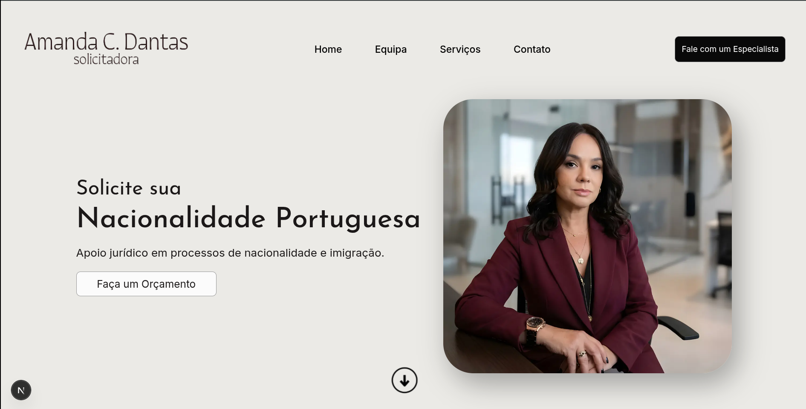

# Nacionalidade Portuguesa | Amanda C. Dantas Solicitadora

Este projeto é uma **landing page / site institucional** focado na prestação de serviços de assessoria jurídica, desenvolvido para **Amanda C. Dantas**, Solicitadora em Portugal. O site tem como objetivo apresentar os seus serviços focados em Nacionalidade Portuguesa, Vistos, Imigração, Família e Sucessões, Direito Imobiliário e Empresas.

O projeto foi pensado como uma página de contato direta e de alta conversão, possuindo uma estética moderna e responsiva, modais ricos em detalhes e fácil capacidade de edição de textos para não-desenvolvedores.



---

## 🚀 Tecnologias e Stack

O site foi construído utilizando as ferramentas de frontend mais modernas do mercado:

- **[Next.js 16 (App Router)](https://nextjs.org/)**: Framework React robusto que lida com o roteamento da aplicação, SEO nativo e otimização de imagens.
- **[React 19](https://react.dev/)**: Biblioteca JavaScript para construção da UI.
- **[Tailwind CSS v4](https://tailwindcss.com/)**: O utilitário CSS que permite a estilização rápida e responsiva sem sair do HTML. Utiliza fluid typography e espaçamentos fluidos (`clamp`) massivamente e a nova diretiva `@theme` configurada globalmente.
- **[TypeScript 5](https://www.typescriptlang.org/)**: Provê seguridade de tipos pra todas as variáveis, garantindo código previsível e manutenível — especialmente importante na configuração dos dados editáveis da página (`interface`s e models dos serviços).

---

## 📂 Arquitetura do Filesystem

O projeto emprega o `App Router` (`/app`) do Next.js de maneira limpa, mantendo a responsabilidade estrutural separada. Todos os componentes organizacionais da Home foram separados de forma modular na pasta de componentes.

```text
nacionalidade-portuguesa/
├── app/                       # Raiz do App Router do Next.js
│   │
│   ├── components/            # Componentes React (Isolados e Modulares)
│   │   ├── ConteudoPagina/    # Renderizador dinâmico p/ páginas de texto (Política, Serviços)
│   │   ├── CookieBanner/      # Banner de consentimento (UI + arquivo de dados configuráveis)
│   │   ├── Perfil/            # Container e lógicas da seção Quem Somos, Bios e Feedbacks
│   │   ├── Footer/            # Rodapé global e cards de contato (e-mail, local, número)
│   │   ├── Header/            # Cabeçalho resposivo (Menu mobile e Desktop)
│   │   ├── Hero/              # Banner Hero inicial da Landing Page
│   │   ├── Icons/             # Ícones em formato de componentes React/SVG em linha
│   │   ├── Servicos/          # Grid de serviços, Cards e Modais super detalhados
│   │   ├── ButtonEspecialista.tsx # Componentes Button de chamadas para ação global
│   │   ├── CardBranco.tsx         # Estrutura base de UI em "clipping" visual do layout
│   │   └── SecondaryPageLayout.tsx # Container padrão com Header/Footer para rotas filhas
│   │
│   ├── empresas/              # Rota para pág. de serviços para empresas
│   ├── familia-sucessoes/     # Rota para pág. de serviços de Família
│   ├── nacionalidade/         # Rota de captura de leads integrada ao form do Tally.so
│   ├── politica-privacidade/  # Rota com o termo extenso sobre a lei de privacidade
│   ├── globals.css            # Variáveis CSS e custom scrollbars (Tailwind config via @theme)
│   ├── layout.tsx             # Raiz da árvore de componentes (<html lang="pt"> e injetores)
│   └── page.tsx               # Rota inicial do Sistema englobando todas as seções (Home)
│
├── public/                    # Assets brutos servidos estaticamente (Fotos, favicons e svgs)
├── GUIA_EDICAO.md             # Guia rápido voltado pro cliente final para alteração de textos
└── package.json               # Dependências do NPM & NPM scripts
```

## 📝 Atualização de Conteúdos Sem Código

Para garantir autonomia ao cliente, os dados do site (como biografia, depoimentos, e textos explicativos) foram convertidos para arquivos estáticos (`.ts` formatados em dicionários) para separar "O que mostrar" de "Como mostrar".

Com as instruções fornecidas no arquivo `GUIA_EDICAO.md` localizado na raiz do projeto, é possível modificar os conteúdos de forma muito simples abrindo tais arquivos, encontrando a chave "texto" e substituindo os caracteres entre aspas, o que exime a necessidade de navegar nas dezenas de componentes estilizados.

---

## 🛠️ Como rodar o projeto localmente

Foi utilizado o pacote gestor `pnpm` (`mise`) como padronização de ambiente durante o desenvolvimento.

Para baixar as dependências e inicializar:

```bash
# Instalar as dependências
pnpm install

# Rodar em modo de desenvolvimento
pnpm dev
```

O servidor vai inicializar em [http://localhost:3000](http://localhost:3000).

Para exportar e publicar gerando uma build de produção altamente otimizada, basta inicializar pelo comando `pnpm build`.
